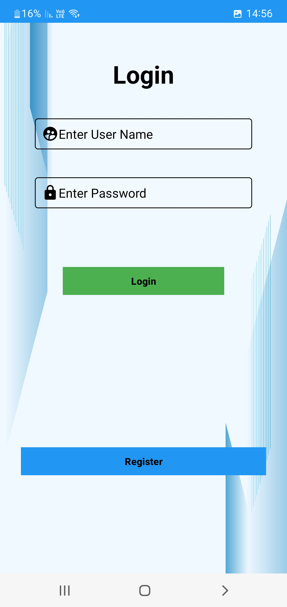
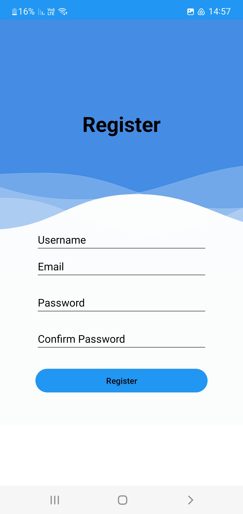
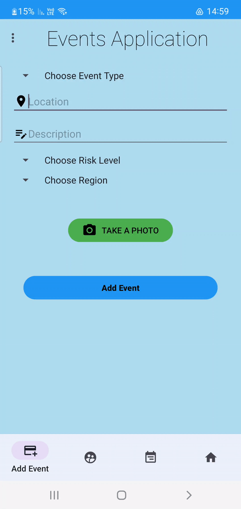
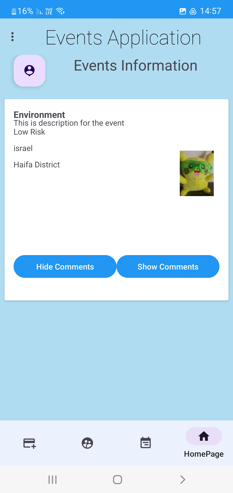

# EventReport
Android Studio application for reporting events

## Table of Contents
1. [Login Page](#login-page)
2. [Register Page](#register-page)
3. [Add new Event](#add-new-event)
4. [HomePage](#homepage)
   - [User with his events](#user-with-his-events)
   - [Other user's HomePage](#other-users-homepage)

## Login Page

## Register Page

## Add new Event

## HomePage

### User with his events

### Other user's HomePage

